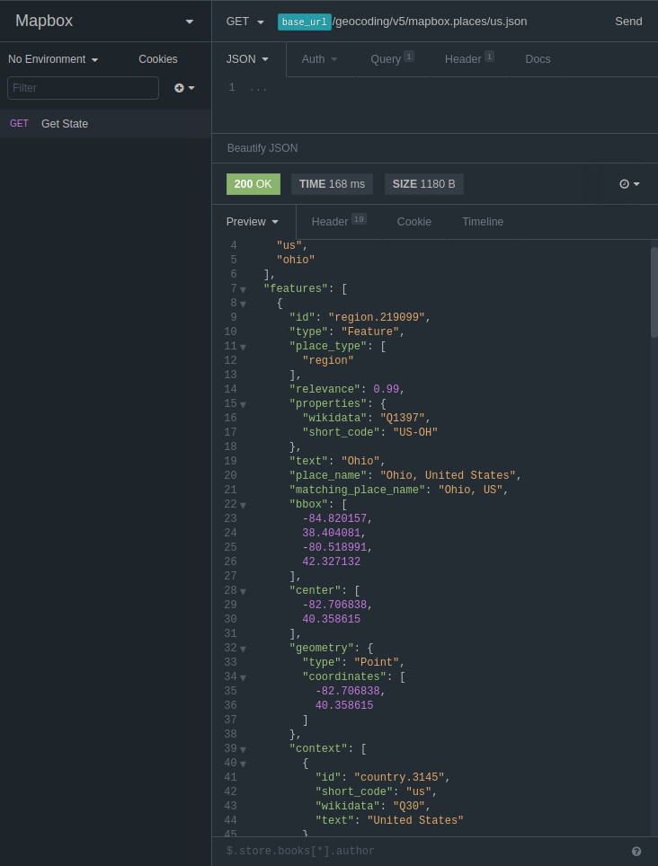

# One Dark Customized

This is a plugin to add some _very slight_ customizations to [Insomnia](https://insomnia.rest)'s One Dark core theme.  
The original theme for Insomnia was created by [@gschier](https://github.com/gschier) and is located [here](https://github.com/getinsomnia/insomnia/blob/develop/plugins/insomnia-plugin-core-themes/themes/one-dark.js)

Install the [npm package](https://npmjs.org/insomnia-plugin-theme-onedark-z) in [Insomnia's Preferences](https://support.insomnia.rest/article/26-plugins#managing-plugins)

